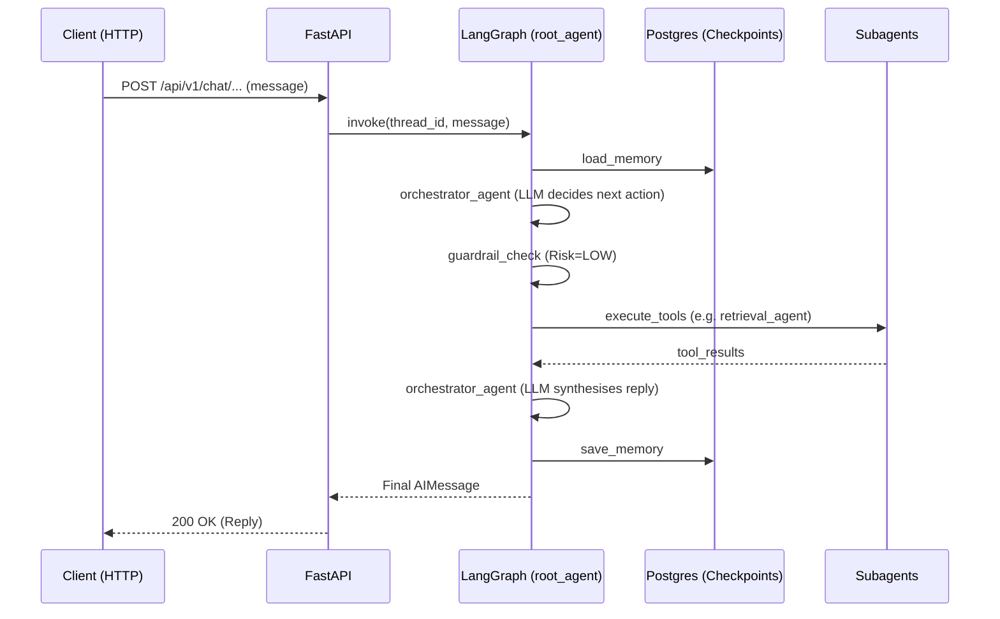
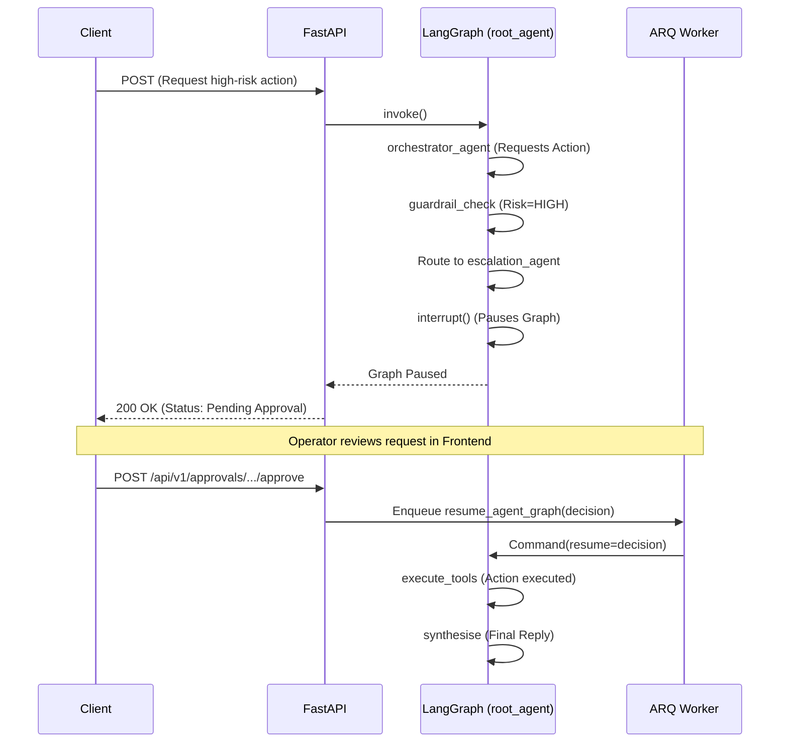

# Architecture

The Autonomi Support System uses a multi-agent orchestrated pattern backed by a FastAPI HTTP server, a PostgreSQL database (with pgvector), and an ARQ task worker. 

## System Components
1. **API Server (FastAPI)**: Stateless HTTP server that handles authentication, workspace management, and incoming chat turns. No WebSockets are used; all chat interactions are HTTP POSTs.
2. **Background Worker (ARQ + Redis)**: Handles long-running or non-blocking tasks, specifically document processing and async LangGraph resumption after an operator approves a high-risk action.
3. **Database (PostgreSQL + pgvector)**: Acts as the unified storage layer. Stores application state, LangGraph checkpoints (for pausing/resuming graphs), and document embeddings for the Retrieval Agent.
4. **Agent Orchestrator (LangGraph)**: The core reasoning engine. A ReAct loop that routes between long-term memory retrieval, guardrail checks, and subagent tools.
5. **Next.js Frontend (External)**: An external repository that provides the admin UI.

## Data Flow: Standard Conversation Turn

## Data Flow: High-Risk Action (HITL)

## Key Architectural Decisions
- **HTTP vs WebSockets**: Chat is currently implemented via stateless HTTP POSTs, not WebSockets, to simplify initial scaling and infrastructure.
- **LangGraph Checkpoints in Postgres**: By writing LangGraph checkpoints directly to Postgres, agent executions can be safely paused (interrupt) and resumed by entirely different worker instances.
- **Guardrails Pre-empt Subagents**: The Orchestrator's requested tool calls are intercepted and vetted *before* being executed by the Action Agent, ensuring dangerous parameters are caught early.

## Known Limitations & Gaps
- **Single Postgres Instance / No True RLS Multi-tenancy**: While multi-tenancy is modeled via `workspace_id`, the API connects as a standard Postgres user; true Row-Level Security (RLS) enforcement at the connection layer is not currently implemented.
- **Hybrid Search**: Currently, retrieval relies purely on dense vector similarity search; BM25 or hybrid cross-encoder reranking is not implemented in the current iteration.

*Last verified against commit/code state: Checked support_system/root_agent/graph.py, backend/worker.py, and chat routers.*
