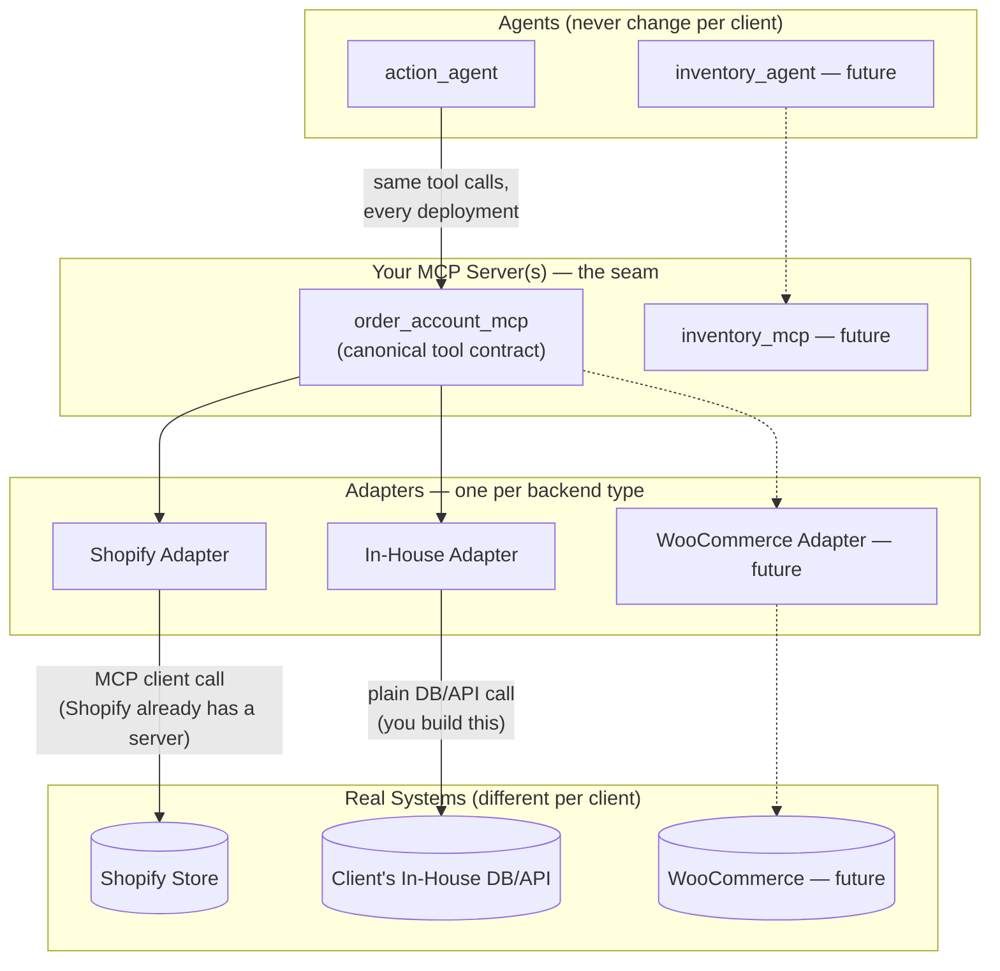
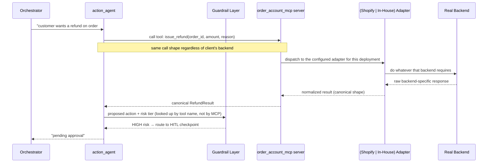
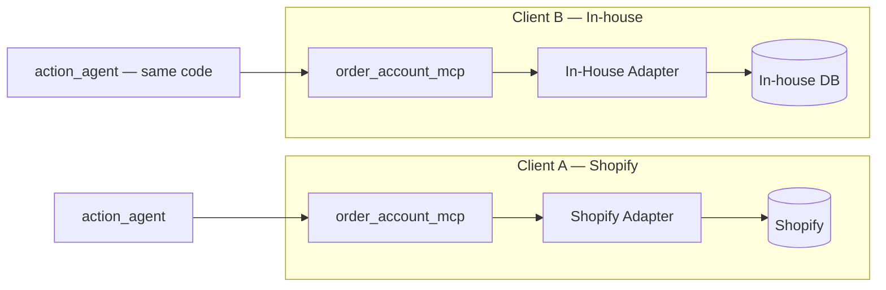

# MCP Architecture for the Support System — How It Actually Works

This explains the MCP layer we're building for `action_agent` (and future agents like
`inventory_agent`): what MCP is, why it fits a multi-backend product, how the pieces are
structured, and what gets built vs. reused per client deployment.

Shopify is a stand in for customers who already have their own MCP.
---

## 1. The core distinction MCP discussions usually skip

MCP is **not** an integration technology. It is a **standard shape for exposing tools to an
LLM** — a protocol, not a magic connector. Something on the other end still has to do the
actual work of talking to a database or a REST API. MCP just standardizes *how the agent
sees that work*, so the agent's code doesn't need to change based on what's behind the tool.

```text
┌─────────────────────────────────────────────────────────────────┐
│  WITHOUT MCP                                                     │
│                                                                    │
│  action_agent ──(hardcoded call)──► Shopify REST API              │
│  action_agent ──(different hardcoded call)──► In-house DB driver  │
│                                                                    │
│  Every new backend = new code inside action_agent.                │
└─────────────────────────────────────────────────────────────────┘

┌─────────────────────────────────────────────────────────────────┐
│  WITH MCP                                                         │
│                                                                    │
│  action_agent ──(ONE standard call: "issue_refund")──► MCP layer  │
│                                          │                         │
│                     MCP layer picks the adapter behind the scenes │
│                          │                         │               │
│                          ▼                         ▼               │
│                   Shopify adapter          In-house adapter        │
│                          │                         │               │
│                          ▼                         ▼               │
│                Shopify's real API          In-house DB/API         │
│                                                                    │
│  New backend = new adapter. action_agent's code never changes.    │
└─────────────────────────────────────────────────────────────────┘
```

**The win is isolation, not automation.** Nothing gets built "for free" except in the
specific case where a backend already ships its own MCP server (Shopify does; most
in-house systems don't).

---

## 2. Why this matters specifically for a multi-client product

Every client business you onboard has a different backend behind "check order status" or
"issue a refund": Shopify for one, a custom in-house system for another, maybe WooCommerce
or Magento for a third down the line. Without a standard boundary, `action_agent`'s prompt
and tool-calling logic would need to branch per client — fragile, and it re-couples your
core agent to every vendor's API quirks.

MCP gives you a single **seam** to put that variability behind:



The dotted boxes are future work (`inventory_agent`, WooCommerce). Notice the structural
symmetry: adding a new agent or a new backend never touches an existing box — it only adds
one.

---

## 3. The four layers, and what "premade" actually means

There are four distinct layers here, and the recurring confusion is treating them as one
thing:

| Layer | What it is | Who defines it | Ever "premade"? |
|---|---|---|---|
| **Canonical tool contract** | The tool names/params/return-shapes `action_agent` calls (`get_order_status`, `issue_refund`, …) — backend-agnostic | You, once | No — this is yours by definition |
| **MCP server** | The process that exposes the canonical contract over MCP for `action_agent` to connect to | You | No — you always build/host this |
| **Adapter** | The code inside the MCP server that fulfills one canonical call for one specific backend | You, one per backend type | **Sometimes** — only the *internal implementation* of an adapter can lean on something premade |
| **Underlying backend** | The real system being integrated (Shopify, an in-house DB, …) | The client business | N/A |

The place premade tooling actually helps is narrow: **inside a specific adapter's
implementation**, if that backend already exposes its own MCP server (Shopify does), that
adapter's internals become "call Shopify's MCP server" instead of "call Shopify's REST API
directly." Either way, from the outside, the adapter looks identical to every other
adapter — same interface, same shape. An in-house adapter has nothing premade to lean on;
it just talks to the client's DB/API the way you'd always have had to.

```text
                     ┌───────────────────────────────┐
                     │   Adapter Interface (shared)    │
                     │   — every adapter implements     │
                     │     the SAME set of methods       │
                     └───────────────────────────────┘
                                    ▲
                 ┌──────────────────┼──────────────────┐
                 │                  │                  │
        ┌────────────────┐ ┌────────────────┐ ┌─────────────────┐
        │ Shopify Adapter │ │ In-House Adapter│ │ Future Adapter   │
        │                 │ │                 │ │                 │
        │ internally:     │ │ internally:     │ │ internally:     │
        │ MCP client →    │ │ plain DB/API    │ │ whatever fits   │
        │ Shopify's own   │ │ call you write  │ │ that backend    │
        │ MCP server      │ │ from scratch    │ │                 │
        └────────────────┘ └────────────────┘ └─────────────────┘
```

This is why "every adapter gets the premade server" was the wrong mental model — the
interface is shared, the *implementation strategy* is not, and only one path through that
diagram happens to route through something premade.

---

## 4. What a request actually does, end to end



Two things worth noticing:
- The **risk tier lookup is outside MCP entirely** — MCP annotations (`readOnlyHint`,
  `destructiveHint`) are a weak, informal signal; your Guardrail Layer should keep its own
  explicit risk-tier mapping by tool name, not trust the MCP schema's hints as policy.
- The **normalization step** (raw backend response → canonical result shape) happens
  inside the adapter, once. Nothing downstream of the MCP server ever sees a
  Shopify-shaped or in-house-shaped response — only the canonical one.

---

## 5. Per-client deployment — what changes, what doesn't



Per deployment, what actually changes is **configuration**, not code:
- Which adapter is active (a single config value/env var selects it at startup)
- Credentials/connection details for that specific backend
- Anything backend-specific the adapter needs (Shopify shop URL + access token vs. an
  in-house DB connection string)

`action_agent`'s tool-calling logic, the canonical contract, and the Guardrail Layer's
risk-tier config are identical across every client.

---

## 6. Technologies involved

| Concern | What you need | Notes |
|---|---|---|
| MCP protocol implementation | An MCP SDK (Python has an official one; a "FastMCP"-style helper is the common ergonomic wrapper) | Handles the JSON-RPC/tool-schema plumbing so you're not implementing the protocol by hand |
| Transport | Local (stdio) for same-machine agent↔server, or HTTP/SSE for a server reachable over a network | Since your agent runtime and MCP server likely run in the same deployment (per the Docker Compose setup), stdio or local HTTP both work — pick based on whether you want the MCP server independently scalable/restartable |
| Schema/validation | Pydantic (already in your stack via LangGraph's I/O schemas) | Defines the canonical contract's request/response shapes; used both for MCP tool schemas and for each adapter's internal normalization |
| Agent-side MCP client | Whatever your agent framework provides for MCP tool-calling (LangGraph has MCP client adapters) | This is what lets `action_agent` treat MCP tools like any other bound tool |
| Adapter-to-Shopify calls | Shopify's own MCP server/endpoint (already live, no build needed) *or* Shopify's Admin GraphQL API directly, wrapped by your adapter | Only relevant for the Shopify adapter's internals |
| Adapter-to-in-house calls | Whatever the in-house system already uses — a DB driver, an internal REST client | This is genuinely new integration work, same as it would be without MCP |
| Config/secrets per deployment | Environment variables or a secrets manager (Docker secrets for small deployments, Vault for larger ones — matches Section 11 of the architecture doc) | One deployment = one set of backend credentials + one adapter selection |
| Idempotency | Your existing Postgres `executed_actions` table | Idempotency keys generated in the Tool Layer, honored by (or enforced in front of) every adapter, regardless of backend |
| Risk tiering | A config file/table (tool name → risk tier), read by the Guardrail Layer | Deliberately *not* derived from MCP's own hints — this is your policy, not the protocol's |
| Observability | Langfuse spans around each MCP tool call | Lets you see latency/errors per adapter, not just per agent |

---

## 7. Summary — the sentence to give Gemini if it's still not landing

> MCP is a standard interface for tool-calling, not an integration engine. We define our
> own canonical set of tools once; a thin MCP server exposes that contract; and behind it,
> one adapter per backend type does whatever that backend actually requires — sometimes
> that means calling a premade MCP server (Shopify), sometimes it means writing a plain
> API/DB client from scratch (in-house systems). The agent only ever sees the canonical
> contract, so nothing about it changes when the backend changes.
