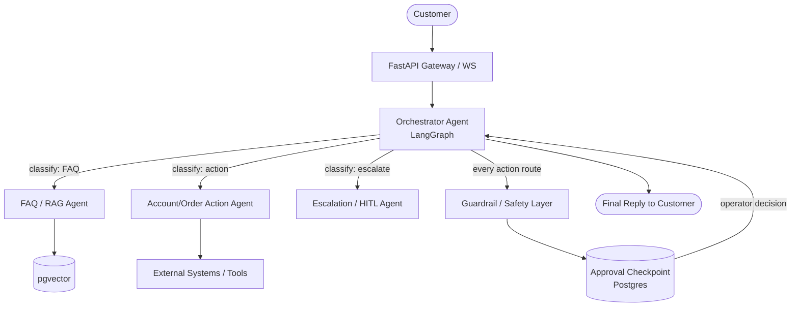
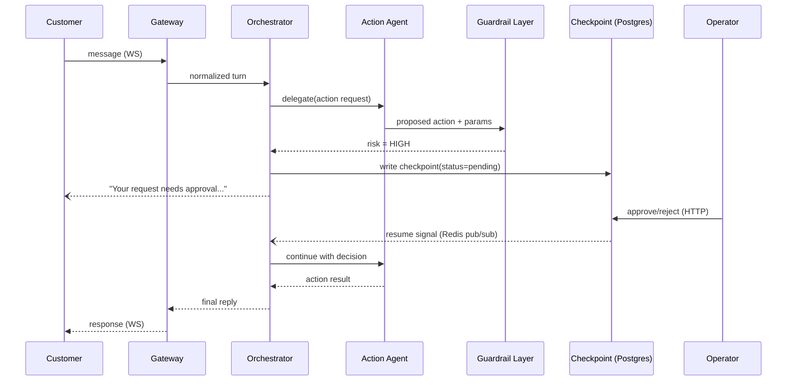
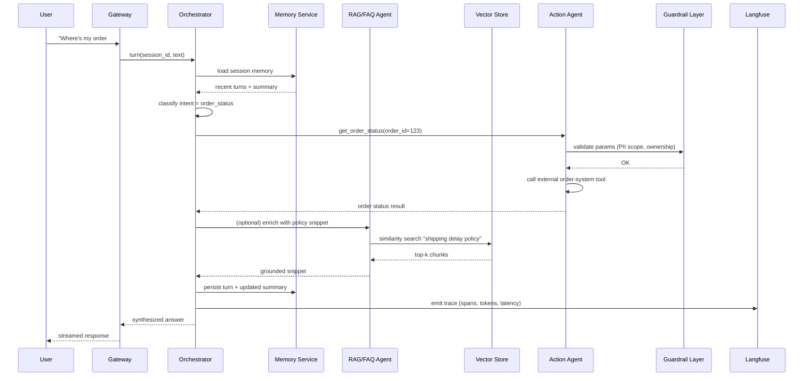
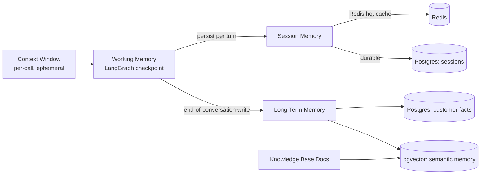
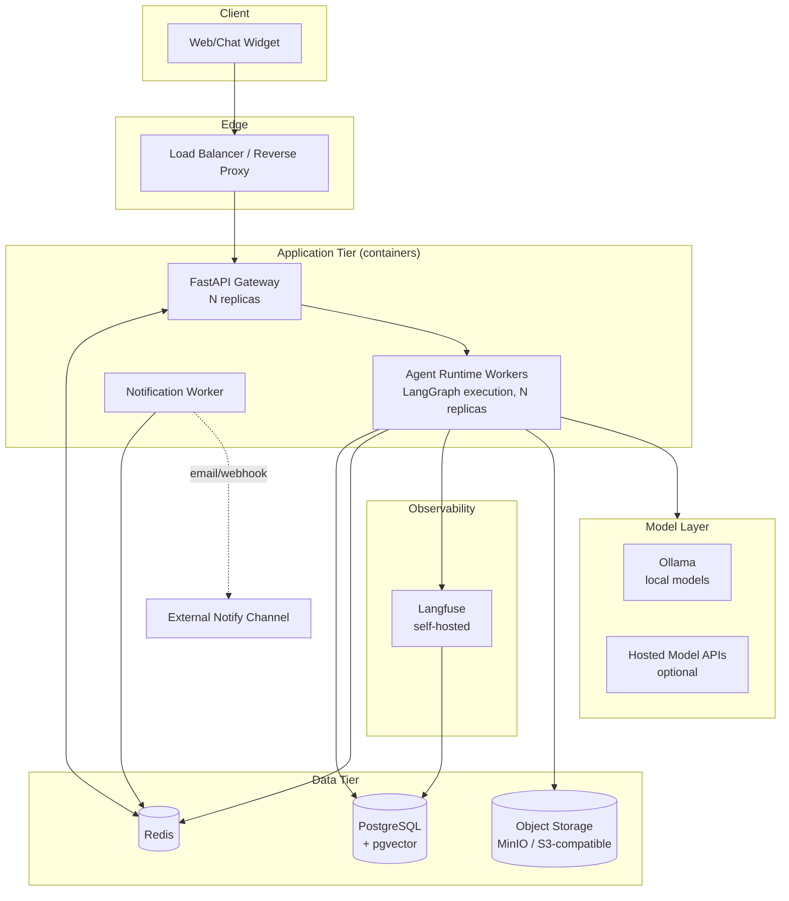
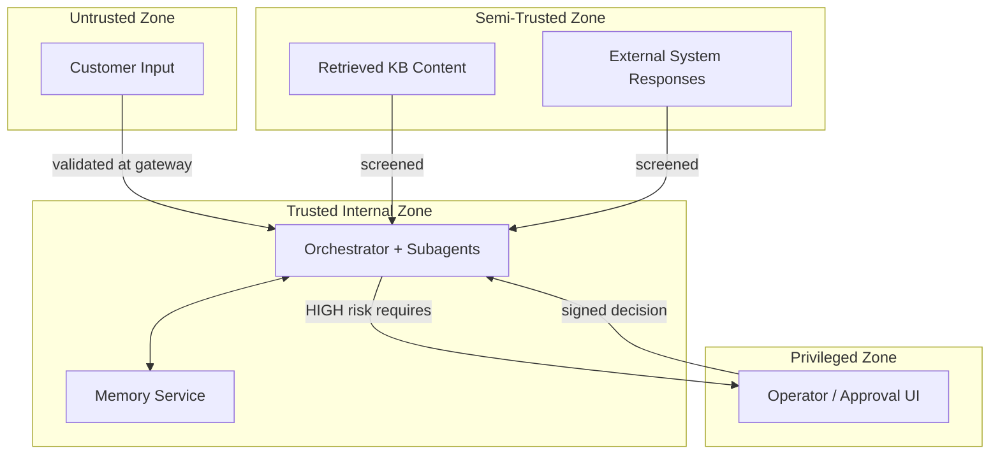

# Multi-Agent Customer Support System — Architecture Design

---

## 1. Problem Understanding

**Goal**
Build a production-grade, self-contained, agentic customer-support platform: a root/orchestrator agent that delegates to stateless specialist subagents to resolve customer requests (FAQ/knowledge lookup, order/account actions, escalations), with strong guardrails, human-in-the-loop (HITL) approval for risky actions, full observability, and a model-agnostic execution harness.

**Users**
- End customers (chat/web widget, possibly email/ticket channels later)
- Support agents / operators (HITL approvers, ticket reviewers)
- System operators (deploy, monitor, tune guardrails/evals)
- Business buyers who self-host the platform (must run largely on OSS, minimal paid subscriptions)

**Inputs**
- Customer messages (text, possibly attachments later)
- Account/order context pulled from external or internal systems
- Knowledge base documents (policies, FAQs, product docs) for RAG
- Operator approve/reject decisions on HITL breakpoints
- Per-agent model configuration (which LLM backs which agent)

**Outputs**
- Conversational responses to the customer
- Executed actions (refunds, order changes, account updates) — only after guardrail/HITL clearance where required
- Audit trail (who/what approved, what tools ran, what was retrieved)
- Observability data (traces, spans, token/cost, latency, success rate) in Langfuse

**Constraints (from prior decisions — treated as fixed)**
- Orchestration: LangGraph, **supervisor/orchestrator pattern** — root agent owns task context; all inter-agent routing centralized through it; subagents are stateless "tools" with no memory of past turns.
- Data: PostgreSQL + pgvector for both relational and vector storage (single DB engine, already needed for LangGraph checkpointers) — no separate vector DB (Qdrant rejected).
- Cache/queue: Redis.
- API layer: FastAPI serving frontend(s).
- Observability: Langfuse, **self-hosted** (rejected LangSmith to avoid external service dependency/cost).
- HITL: internal custom tool (not a third-party HITL product); agent execution **fully pauses** (not backgrounded) while awaiting a decision; states = `pending / approved / rejected / expired / cancelled`; flow = `Agent → Checkpoint → Approval → Resume`; UX needs risk badges + SLA timer; cross-agent isolation enforced at the **data layer** (Postgres RLS/RBAC), not trusted to the LLM; expiry default = auto-escalate, configurable per breakpoint type.
- Guardrails: hybrid — hand-rolled checks + a guardrails library.
- Model harness: must be model-agnostic — any agent's model (including local/Ollama models) swappable independently.
- Distribution model: self-contained/OSS-first, so buyers don't need to manage many extra paid subscriptions. Third-party plugins/tools are optional add-ons, not required for core operation.
- Frontend framework: **not yet decided** (Next.js vs plain React) — treated as an open decision, architecture kept frontend-agnostic behind the FastAPI/WebSocket boundary.

**Assumptions (explicitly labeled — please correct any that are wrong)**
- **A1.** Primary channel is a real-time chat widget (WebSocket), with room to add email/ticketing later without redesign.
- **A2.** Domain is generic e-commerce/SaaS-style support: order status, refunds/returns, account changes, billing questions, FAQ/policy questions. Swap in a different domain by changing the Action subagent's toolset, not the architecture.
- **A3.** "Risky" actions requiring HITL = anything that mutates external state with financial/account impact (refunds, cancellations, account/PII changes). Read-only actions (order lookup, FAQ) do not require HITL.
- **A4.** Single-tenant deployment per instance for v1 (a business runs its own instance); multi-tenant SaaS mode is a v2 concern, noted in Section 16.
- **A5.** Embedding model: left open per your stated uncertainty — architecture treats it as a pluggable component behind an `EmbeddingProvider` interface (Ollama-served local models are a first-class option).
- **A6.** Deployment target: containerized (Docker Compose for self-host simplicity; Kubernetes manifests as an optional path for larger buyers), consistent with the "self-contained, minimal external subscriptions" requirement.

If any of A1–A4 are wrong, the agent catalog and guardrail rules in Sections 4/7/11 are the places to adjust — the rest of the architecture is stable under those changes.

---

## 2. Architecture Overview

This is a **Supervisor (orchestrator) architecture**, not a decentralized/blackboard system:

- A single **Orchestrator Agent** owns the LangGraph state machine for a conversation/task. It receives the user message, decides intent, and calls subagents as tools.
- **Subagents are stateless**: each invocation gets exactly the context the orchestrator hands it (relevant slice of conversation + retrieved data), does its job, and returns a structured result. They never talk to each other directly and never persist their own memory — this keeps failure domains small and makes every subagent independently testable/swappable.
- **Memory, RAG, guardrails, and HITL are cross-cutting services**, not agents — every subagent can call into them, but they don't own orchestration logic.
- **HITL is modeled as a graph interrupt**: when a subagent's proposed action is flagged, the orchestrator writes a checkpoint to Postgres and the LangGraph run pauses (`interrupt`) until an operator decision resumes it.

**Why Supervisor over the alternatives:**
- *Sequential agents*: too rigid — support requests branch heavily (FAQ vs. account action vs. escalation) and need dynamic routing.
- *Planner-worker*: close, but implies multi-step autonomous planning ahead of execution; support turns are mostly single-hop (classify → retrieve/act → respond), so a full planner is unneeded complexity for v1 (see Section 16 for when to add it).
- *Event-driven / blackboard*: better for decentralized, many-writers systems; support here needs **centralized control** (you explicitly required all routing through the root agent) for auditability and simpler guardrail enforcement — a blackboard would scatter authorization decisions across agents.
- **Supervisor** fits: one place owns context and control flow, matches your stated design, and makes HITL/guardrail enforcement a single choke point instead of a distributed concern.

---

## 3. High-Level Diagram

```text
                        +------------------+
                        |     Customer     |
                        +--------+---------+
                                 |
                                 v
                     +-----------------------+
                     |  FastAPI Gateway (WS)  |
                     +-----------+------------+
                                 |
                          normalizes turn
                                 |
                                 v
                     +-----------------------+
                     |   Orchestrator Agent   |<---------------------------+
                     |   (LangGraph graph)    |                            |
                     +-----------+------------+                            |
                                 |                                          |
                          classifies + routes                               |
                                 |                                          |
        +------------+----------+----------+                               |
        |            |                     |                               |
        v            v                     v                               |
  +----------+ +-------------+     +---------------+                       |
  | FAQ/RAG  | | Account/    |     | Escalation /  |                       |
  | Agent    | | Order Action|     | HITL Agent    |                       |
  +----+-----+ +------+------+     +-------+-------+                       |
       |              |                    |                               |
       v              v                    v                               |
  +---------+   +----------------------------------------+                 |
  | Vector  |   |       Guardrail / Safety Layer          |                 |
  | Store   |   | every proposed action & output routes   |                 |
  | (pgvec) |   |     through here before it proceeds     |                 |
  +---------+   +---------------------+--------------------+                 |
                                       |                                     |
                              pass  /  flag-for-approval                     |
                                 +-----+-----+                               |
                                 |           |                               |
                                 v           v                               |
                         +-----------+  +-------------+                     |
                         | External  |  | Approval    |                     |
                         | Systems / |  | Checkpoint  |---------------------+
                         | Tools     |  | (Postgres)  |
                         +-----------+  +-------------+
                                 |
                                 v
                     +-----------------------+
                     |     Final Reply       |
                     +-----------------------+
```

**Equivalent Mermaid:**



---

## 4. Component Catalog

| Component | Type | Responsibility | Depends on |
|---|---|---|---|
| FastAPI Gateway | API/Service | Auth, WS session, request normalization, streams tokens to client | Orchestrator, Redis |
| Orchestrator Agent | Agent | Owns conversation state, intent routing, tool/subagent invocation, final synthesis | LangGraph runtime, Memory Service, Guardrail Layer |
| FAQ/RAG Agent | Agent | Answers knowledge questions from the KB via retrieval | Vector Store, Embedding Provider |
| Account/Order Action Agent | Agent | Executes account/order operations via external tool calls | Tool Layer, External Systems, Guardrail Layer |
| Escalation/HITL Agent | Agent | Packages risky actions into an approval request, waits on decision | Approval Checkpoint Store, Notification Service |
| Guardrail / Safety Layer | Service | Input/output validation, PII checks, policy rule checks, risk scoring | Guardrails library, hand-rolled rules |
| Memory Service | Service | Session memory read/write, long-term memory retrieval/write | PostgreSQL, Redis |
| Vector Store | Database | Stores embeddings for KB documents and (optionally) long-term semantic memory | PostgreSQL/pgvector |
| Relational Store | Database | Conversations, tickets, approvals, audit log, RLS-scoped agent data | PostgreSQL |
| Redis | Cache/Queue | Session cache, rate limiting, short-lived locks, background job queue | — |
| Tool Layer / MCP Gateway | Service | Uniform tool-calling interface (internal tools + optional MCP servers) | External Systems |
| Model Router | Service | Resolves "which model backs this agent" per config, supports local (Ollama) and hosted models | Model Provider adapters |
| Langfuse | Service | Traces, spans, token/cost tracking, evals | PostgreSQL (Langfuse's own schema) |
| Approval/Checkpoint Store | Database (logical) | HITL state machine records: pending/approved/rejected/expired/cancelled | PostgreSQL (RLS-scoped) |
| Notification Service | Service | Alerts operators of pending approvals (SLA timer) | Redis (queue), email/webhook |
| Object Storage | Storage | Raw KB source documents, attachments (optional in v1) | Filesystem or S3-compatible (MinIO) |

---

## 5. Communication Architecture

| Link | Mode | Protocol |
|---|---|---|
| Customer ↔ Gateway | Synchronous (request) + streamed response | HTTP (auth) / WebSocket (chat turns) |
| Gateway ↔ Orchestrator | Synchronous, in-process or local call | Function call (same runtime) |
| Orchestrator → Subagents | Synchronous, tool-call style | LangGraph node invocation (in-process) |
| Subagents → Tool Layer | Synchronous | HTTP / MCP |
| Tool Layer → External Systems | Synchronous | HTTP/REST or MCP |
| Orchestrator ↔ Memory Service | Synchronous | SQL / internal API |
| RAG Agent ↔ Vector Store | Synchronous | SQL (pgvector similarity query) |
| Guardrail Layer → Approval Checkpoint | Synchronous write, then **async wait** | SQL write + LangGraph `interrupt` |
| Operator UI → Approval Checkpoint | Synchronous | HTTP (FastAPI endpoint) |
| Approval decision → Orchestrator resume | Asynchronous event | Redis Pub/Sub → LangGraph `resume` |
| Notification Service | Asynchronous | Redis queue → email/webhook worker |
| All agents/services → Langfuse | Asynchronous, fire-and-forget | HTTP (batched trace export) |



---

## 6. Request Lifecycle (Sequence Diagram)



Key stages present in every request: **classification → memory load → delegation → (guardrail check) → tool/retrieval → synthesis → memory write → trace emit → response**. HITL only inserts a pause between guardrail check and tool execution when risk is flagged.

---

## 7. Agent Specifications

### Orchestrator Agent
- **Purpose:** Own the conversation graph; single point of control and auditability.
- **Responsibilities:** Intent classification, routing, context assembly for subagents, response synthesis, memory read/write triggers, initiating HITL interrupts.
- **Inputs:** Raw user turn, session memory, subagent results.
- **Outputs:** Final natural-language response; state transitions.
- **Available tools:** None directly — it delegates; it may call Memory Service and Guardrail Layer directly (not user-facing tools).
- **Memory permissions:** Read/write session memory; read (not write) long-term memory.
- **Decision authority:** Full routing authority; cannot itself execute mutating actions (must always go through Action Agent + Guardrail Layer).
- **Failure handling:** On subagent timeout/error, retries once, then returns a graceful fallback message and logs an incident span.
- **Parallel execution:** Can fan out read-only subagents (e.g., RAG + order lookup) in parallel; never parallelizes mutating actions.

### FAQ / RAG Agent
- **Purpose:** Answer knowledge/policy questions grounded in the KB.
- **Responsibilities:** Query rewriting, vector similarity search, re-ranking, answer grounding, citation of source chunk IDs.
- **Inputs:** User question (+ orchestrator-provided context slice).
- **Outputs:** Grounded answer text + source references.
- **Available tools:** `vector_search`, `keyword_search` (hybrid retrieval fallback).
- **Memory permissions:** None (stateless); reads Vector Store only.
- **Decision authority:** None — cannot take actions, read-only.
- **Failure handling:** On empty/low-confidence retrieval, returns "insufficient KB coverage" signal so orchestrator can escalate or ask a clarifying question.
- **Parallel execution:** Yes.

### Account / Order Action Agent
- **Purpose:** Execute account and order operations against external systems.
- **Responsibilities:** Parameter validation, tool invocation, mapping external system responses to structured results.
- **Inputs:** Structured action request from orchestrator (action type + params).
- **Outputs:** Action result or "needs approval" signal.
- **Available tools:** Domain tools behind the Tool Layer (`get_order`, `issue_refund`, `update_shipping_address`, `cancel_order`, etc.), each tagged with a **risk level**.
- **Memory permissions:** None (stateless); may read customer/account record via tool call (not raw DB access).
- **Decision authority:** Can execute LOW-risk (read-only) tools autonomously; MEDIUM/HIGH-risk tools always route through Guardrail Layer → possible HITL.
- **Failure handling:** External system errors are retried with exponential backoff (bounded); on exhaustion, returns a failure result the orchestrator can surface honestly to the user.
- **Parallel execution:** Read-only calls yes; mutating calls no (serialized per session to avoid double-execution).

### Escalation / HITL Agent
- **Purpose:** Manage the human-approval lifecycle for flagged actions, and handoff to a human agent for out-of-scope requests.
- **Responsibilities:** Create checkpoint record, notify operators, enforce SLA timer, apply expiry policy, resume orchestrator on decision.
- **Inputs:** Flagged action + risk metadata from Guardrail Layer.
- **Outputs:** Approval decision (or expiry/auto-escalation outcome).
- **Available tools:** `create_checkpoint`, `notify_operator`, `poll_decision`.
- **Memory permissions:** Read/write to the Approval Checkpoint store only (RLS-scoped; cannot read other agents'/sessions' checkpoints).
- **Decision authority:** Cannot itself approve/reject — that authority belongs to a human operator; the agent only manages state transitions and timers.
- **Failure handling:** On notification-channel failure, falls back to a secondary channel (e.g., webhook fails → email) and logs; on timer expiry, applies the configured per-breakpoint-type default (currently: auto-escalate).
- **Parallel execution:** Yes — multiple independent checkpoints can be open concurrently across sessions.

### Guardrail / Safety Layer *(cross-cutting service, not a routable agent)*
- **Purpose:** Validate every subagent input/output and every proposed action before execution.
- **Responsibilities:** PII detection/redaction, jailbreak/prompt-injection screening, policy-rule checks (hand-rolled), schema validation, risk scoring → HITL trigger decision.
- **Inputs:** Proposed action, retrieved content, model output.
- **Outputs:** Pass / block / flag-for-approval + reason.
- **Decision authority:** Can hard-block; cannot approve HIGH-risk actions itself (routes to HITL).

---

## 8. Memory Architecture

| Layer | What lives here | Backing store | Notes |
|---|---|---|---|
| Context window | Current turn + orchestrator-assembled slice for the active subagent call | In-memory (per LangGraph invocation) | Never persisted directly; assembled fresh each call since subagents are stateless |
| Session memory | Rolling recent-turn buffer + running summary for the active conversation | Redis (hot) + Postgres (durable) | Redis for low-latency reads during a live session; Postgres is source of truth, Redis is a cache in front of it |
| Working memory | Orchestrator's scratch state for the current task (e.g., which checkpoint is pending, partial multi-step action progress) | LangGraph checkpointer (Postgres) | This *is* the LangGraph state — also what enables pause/resume for HITL |
| Long-term memory | Cross-session facts about a customer (preferences, past issue history) | Postgres (structured) + pgvector (semantic recall) | Written deliberately at end-of-conversation, not every turn, to avoid noisy/duplicate memory |
| Vector store | KB document embeddings; optionally long-term memory embeddings | Postgres/pgvector | Same physical DB as everything else, per your consolidation decision — logically separated by schema/table |
| Structured relational data | Customers, orders (read-mirror or live lookups), tickets, approvals, audit log | Postgres | RLS enforced here for HITL isolation |
| Cache | Rate limits, dedup keys, pub/sub for resume signals, hot session data | Redis | Ephemeral by design — nothing here is a system of record |



**Rule of thumb:** context window is *derived*, session memory is *durable per conversation*, long-term memory is *durable per customer* and written sparingly/deliberately (not every turn) to keep it high-signal.

---

## 9. State Management

- **Stateless services:** FAQ/RAG Agent, Account/Order Action Agent, Guardrail Layer — no component-local state survives a call; everything needed is passed in or fetched via the Memory Service/Tool Layer.
- **Stateful components:** Orchestrator Agent (via LangGraph checkpointer), Redis (cache/queue), Postgres (system of record).
- **Session ownership:** One LangGraph thread per conversation `session_id`; the Orchestrator is the sole writer to that thread's state. Concurrent messages in the same session are serialized (a simple session-level lock in Redis) to prevent racing writes.
- **Idempotency:** Every mutating tool call carries an idempotency key (derived from `session_id + turn_id + action_type`) so a retried call (e.g., after a timeout where the first attempt actually succeeded downstream) doesn't double-execute (double refund, etc.). External system adapters are required to honor this key or the Tool Layer deduplicates client-side via a Postgres `executed_actions` table.
- **Checkpointing:** LangGraph's Postgres checkpointer persists graph state at every node boundary — this is what makes HITL's "fully pause and resume, potentially after a long real-world delay" possible without keeping a process alive.
- **Recovery after interruption:** If the orchestrator process crashes mid-run, the next request (or the resume signal from an approval) reloads the graph state from the checkpointer and continues from the last committed node — no in-memory-only state exists that isn't recoverable.

---

## 10. Deployment Architecture



- **Client:** thin — chat widget over WebSocket; no business logic.
- **API Gateway (FastAPI):** stateless, horizontally scalable behind the load balancer; holds WS connections and forwards to workers via Redis-backed job/queue or direct async call (small deployments can co-locate gateway + worker in one process).
- **Agent Runtime Workers:** run the LangGraph graph; scale horizontally — each worker can pick up any session because state lives in Postgres, not in worker memory.
- **Queue/Notification Worker:** separate small service so a flaky notification channel never blocks the main request path.
- **Data tier:** single Postgres instance (with read replica optional at scale) serving relational + vector; Redis for cache/queue; object storage for raw KB docs (optional in minimal deployments — can start as local filesystem).
- **Model layer:** Ollama container for local models (default, zero external dependency) with an adapter to swap in hosted providers per agent via config — keeps the "self-contained, minimal subscriptions" requirement intact by default while leaving the door open.
- **Packaging:** Docker Compose file bundling API, worker(s), Postgres, Redis, Langfuse, Ollama for single-box self-hosting; Kubernetes manifests as an optional scale-out path (noted as v2 in Section 16, not required for v1).

This is intentionally a **separate diagram from the logical architecture** (Section 3) — Section 3 shows *who talks to whom logically*, this shows *what physically runs where*.

---

## 11. Security & Trust Boundaries

**Trust zones:**
1. **Untrusted:** Customer browser/client input — never trusted, always passes through Guardrail Layer before influencing action execution.
2. **Semi-trusted:** Retrieved content (KB chunks, external system responses) — treated as data, not instructions (prompt-injection screening applies here too).
3. **Trusted (internal):** Orchestrator, subagents, Memory Service — trusted to *propose* actions, never trusted to unilaterally execute HIGH-risk ones.
4. **Privileged:** Operator/approval interface — the only zone that can authorize HIGH-risk actions.



- **Authentication:** Customers authenticate to the Gateway (session token / OAuth to the host business's identity system); operators authenticate separately with elevated credentials (SSO recommended for self-hosters).
- **Authorization:** RBAC at two levels — (a) which tools an agent may call (enforced in the Tool Layer, not left to the LLM's judgement), (b) which operator roles may approve which breakpoint types.
- **Agent permissions:** Each subagent has an explicit **tool allowlist**; the Tool Layer rejects any call to a tool not on that agent's list, independent of what the LLM "decides."
- **Secret management:** API keys/model credentials never enter the LLM context; loaded server-side via env/secret store (e.g., Docker secrets, or Vault for larger deployments) and injected at the adapter layer.
- **Tool sandboxing:** External-system tool calls go through the Tool Layer's schema-validated adapters (no arbitrary code execution from agent output); any code-execution tool (if ever added) runs in an isolated, resource-capped container.
- **Data isolation (HITL cross-agent isolation):** Enforced via **Postgres Row-Level Security** on the approval/checkpoint tables — a policy scopes rows by `session_id`/`tenant_id` and requestor role, so isolation is a database-guaranteed property, not something the orchestrator has to "remember" to enforce. This directly matches your stated decision to enforce isolation at the RLS/RBAC layer rather than trusting the LLM.
- **Audit logging:** Every tool call, guardrail verdict, and approval decision is written to an append-only `audit_log` table (who/what/when/result) independent of Langfuse traces (traces are for debugging/perf; audit log is for compliance and is retained longer).

---

## 12. Failure Analysis

| Failure | Detection | Recovery | User impact |
|---|---|---|---|
| Hallucinated/ungrounded RAG answer | Guardrail checks citation presence + confidence threshold from retrieval score | Fall back to "I don't have a confident answer, escalating" instead of answering | Slight delay; avoids wrong info |
| Tool call failure (external system down) | HTTP error / timeout from Tool Layer adapter | Bounded retry w/ backoff; on exhaustion, honest failure message + optional escalation | Told directly rather than silently stalling |
| Timeout (LLM or tool) | Per-call timeout budget enforced by orchestrator | Cancel + single retry; if still failing, graceful fallback response | Possible short wait, then clear message |
| Queue congestion (notification/job queue) | Redis queue depth metric threshold | Autoscale worker pool; degrade to email-only notification if webhook path backs up | Approval SLA timer may extend; operator gets a stale-but-eventual alert |
| Memory service unavailable (Postgres down) | Health check / connection failure | Orchestrator degrades to context-window-only mode (no session history) with a clear disclaimer, or fails closed for mutating actions | Personalization/context temporarily lost; no data loss (writes queued/retried, not silently dropped) |
| Partial agent failure (subagent crashes mid-call) | Exception surfaced to orchestrator node | Orchestrator retries once with same params (idempotency key prevents double-effect); else fallback | Minimal — usually invisible retry |
| Rate limits (model provider) | 429 from provider adapter | Model Router fails over to a configured backup model (can be local Ollama model) for that agent | Possible quality dip on fallback, but no outage |
| Duplicate mutating action (e.g. double refund) | Idempotency key collision detected in `executed_actions` table | Second call short-circuited, returns original result | None — invisible |
| HITL checkpoint expires unanswered | SLA timer in Escalation Agent | Auto-escalate per configured policy (default) | Customer told it's escalated to a human, not silently dropped |
| Prompt injection via retrieved content or user input | Guardrail Layer pattern/heuristic + library-based screening | Block the specific instruction, continue with sanitized content, log the attempt | Usually invisible; worst case a "can't help with that" reply |

---

## 13. Observability

- **Logs:** Structured JSON logs per service (Gateway, Orchestrator, Tool Layer, Notification Worker) — correlation ID = `session_id` + `turn_id` threaded through everything.
- **Metrics:** Request rate, error rate, p50/p95/p99 latency per agent node, queue depth, HITL pending count, HITL SLA breach count, model-fallback trigger count, retrieval hit-rate (top-k similarity score distribution).
- **Traces:** Langfuse trace per conversation turn; nested spans per node (classification, each subagent call, each tool call, guardrail check).
- **Agent spans:** Each subagent invocation is its own Langfuse span with inputs/outputs (PII-redacted before export), model used, and duration — this is what makes "which agent is slow/wrong" debuggable.
- **Token usage / cost tracking:** Per-agent, per-model token counts and computed cost recorded on each span; rolled up daily per conversation and per tenant (relevant even in single-tenant v1, since it tells you cost-per-resolved-ticket).
- **Latency:** End-to-end turn latency plus per-node breakdown, so you can see whether slowness is model, retrieval, or external tool.
- **Success rate:** Defined as "resolved without escalation to a human, without a guardrail block, and without an explicit failure message" — tracked as a rolling metric, segmented by intent type.
- **What to actively monitor/alert on:** guardrail block-rate spikes (possible attack or KB drift), HITL SLA breaches, external tool error-rate spikes, model fallback rate (indicates provider issues), p95 latency regressions.

---

## 14. Scalability Strategy

- **Horizontal scaling:** Both Gateway and Agent Runtime Workers are stateless-at-the-process level (all durable state in Postgres/Redis) — scale by adding replicas behind the load balancer.
- **Parallel agents:** Read-only subagent calls (RAG + order lookup) fan out concurrently within a single turn to cut latency; mutating actions stay serialized per session for correctness.
- **Worker pools:** Separate pool sizing for interactive (chat-turn) workers vs. background (notification/expiry-sweep) workers so a notification backlog never starves live chat.
- **Event queues:** Redis-backed queue absorbs bursts (e.g., many simultaneous checkpoint expirations) without blocking the request path.
- **Load balancing:** Standard round-robin/least-connections at the reverse proxy for the Gateway tier; WebSocket sessions are sticky to a Gateway instance but not to a specific Worker (workers are chosen per-turn based on availability since state lives in Postgres).
- **Backpressure:** Gateway enforces a max-in-flight-turns-per-session and a global concurrency cap; when exceeded, new turns are queued with a "still working on it" UX rather than dropped or overloading workers.
- **Cost optimization:** Model Router prefers cheaper/local models for low-stakes classification/routing calls and reserves higher-capability (possibly hosted) models for final synthesis or complex reasoning — configurable per agent, which is exactly what the model-agnostic harness requirement enables.

---

## 15. Architectural Decision Record (ADR)

| Decision | Alternatives considered | Why chosen |
|---|---|---|
| Supervisor/orchestrator pattern, centralized routing | Planner-worker; event-driven/blackboard; fully decentralized peer agents | Matches your requirement for one root agent owning context and routing; simplest to secure (single choke point for guardrails/HITL) and audit |
| Subagents fully stateless | Subagents keep their own memory | Stateless subagents are independently testable/swappable/scalable and prevent context drift between agent calls; orchestrator is the single source of truth |
| Single Postgres (+pgvector) instead of separate vector DB | Qdrant, Pinecone, Weaviate | Already need Postgres for LangGraph checkpointing; consolidating reduces operational surface area, fits "self-contained, few subscriptions" goal |
| Redis for cache + queue | Separate message broker (RabbitMQ/Kafka) for queue | Redis is simpler to self-host and sufficient at expected scale; avoids adding a second infra dependency |
| Langfuse self-hosted for observability | LangSmith (hosted) | Avoids recurring external service dependency/cost, matches self-contained distribution model |
| HITL as a LangGraph `interrupt` + Postgres checkpoint | Background job with polling only, no true pause | True pause/resume is more correct (no wasted compute, no partial-state ambiguity) and directly supported by LangGraph's checkpointer |
| Isolation for approvals enforced via Postgres RLS/RBAC | Enforce isolation in application code only | Database-level enforcement is harder to accidentally bypass than an application-layer check that could be missed in one code path |
| Model-agnostic Model Router with per-agent config | Hardcode one model for the whole system | Buyer requirement: swap models (including local) per agent without redesign; also enables cost optimization (Section 14) |
| Hybrid guardrails (hand-rolled + library) | Library-only or hand-rolled-only | Library covers common cases (PII, known jailbreak patterns) fast; hand-rolled rules capture domain-specific policy (e.g., refund limits) a generic library won't know |
| Docker Compose as primary packaging, Kubernetes optional | Kubernetes-only | Keeps v1 self-hostable by smaller buyers without requiring cluster expertise; Kubernetes path documented but not mandatory |

---

## 16. Critical Review

**Strengths**
- Centralized routing makes guardrail/HITL enforcement a single, auditable choke point rather than a distributed concern.
- Stateless subagents + single consolidated datastore keep the operational surface small — important for a self-hosted, buyer-run product.
- HITL modeled as a true graph interrupt (not a polling hack) is correct and recoverable across process restarts.
- Model-agnostic router directly satisfies the "swap models per agent, including local" requirement while also giving a cost lever.

**Weaknesses**
- Single Postgres instance is a shared bottleneck for relational, vector, checkpoint, and (if co-located) Langfuse data — fine at v1 scale, but will need read replicas / connection pooling discipline (PgBouncer) as load grows.
- Orchestrator-as-single-writer is simple but is a scaling and blast-radius concentration point — a bug in orchestrator logic affects every conversation.
- Current design assumes mostly single-hop turns (classify → act → respond); genuinely multi-step customer issues (e.g., "investigate why my last three orders were late") aren't well served without a planning layer.
- No explicit multi-tenancy design yet (A4) — RLS policies will need a `tenant_id` dimension added before this can be sold as multi-tenant SaaS rather than self-hosted single-tenant.

**Risks**
- *Technical:* pgvector performance at large KB scale (millions of chunks) may need tuning (HNSW index config) or eventually a dedicated vector engine — currently deferred in favor of operational simplicity.
- *Technical:* RLS policy correctness is security-critical and easy to get subtly wrong (e.g., missing a policy on a new table) — needs a test suite specifically for isolation, not just functional tests.
- *Operational:* Self-hosted Langfuse + Ollama + Postgres + Redis on one box (small buyers) may be resource-constrained; needs documented minimum specs and possibly a "lite mode" (fewer replicas, smaller models).
- *Operational:* Auto-escalation on HITL expiry is a good default but could create alert fatigue if breakpoint SLAs are set too aggressively — needs tuning guidance per breakpoint type.

**Next Evolution (v2)**
- Add a lightweight **planning layer** for multi-step investigative requests, without abandoning the supervisor pattern (planner becomes a component the orchestrator consults, not a new control-flow authority).
- Add `tenant_id` to all RLS policies and the checkpoint/audit schema to support multi-tenant SaaS deployment.
- Introduce read replicas / connection pooling (PgBouncer) and revisit vector search performance once KB size is known.
- Formalize an isolation-focused RLS test suite (per your still-open item on RLS policy design) before HITL cross-agent isolation ships to production.
- Optional Kubernetes deployment path with autoscaling for buyers outgoing single-box deployment.
- Expand channels beyond chat (email/ticketing) by adding channel-specific adapters at the Gateway layer only — the rest of the architecture shouldn't need to change (validates the design's modularity).
